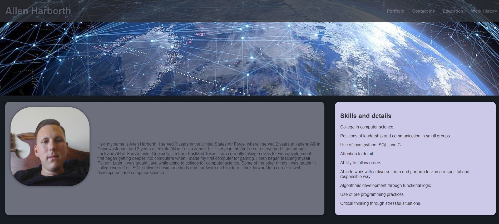
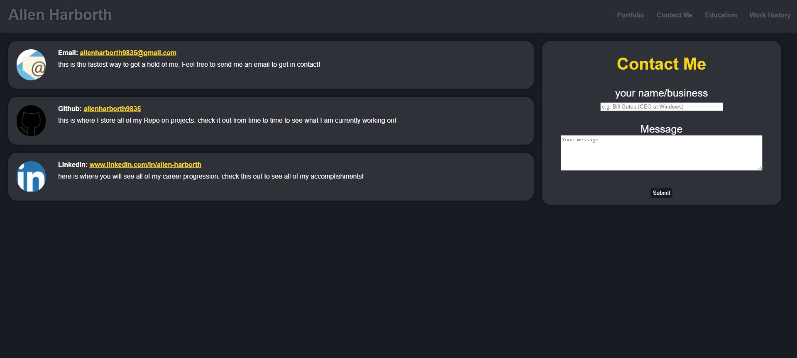

# allenharborth9835.github.io Week 2 Challenge

For this week challange we were tasked with creating a website to show off our portfolio using the what we learned in class for HTML and CSS. for this website I created several pages for my profile, contact information, and my basic bio.

the challenge that was given & Acceptance Criteria was as follows

### user story

AS AN employer\
I WANT to view a potential employee's deployed portfolio of work samples\
SO THAT I can review samples of their work and assess whether they're a good candidate for an open position

### Acceptance Criteria

GIVEN I need to sample a potential employee's previous work\
WHEN I load their portfolio\
THEN I am presented with the developer's name, a recent photo or avatar, and links to sections about them, their work, and how to contact them\
WHEN I click one of the links in the navigation\
THEN the UI scrolls to the corresponding section\
WHEN I click on the link to the section about their work\
THEN the UI scrolls to a section with titled images of the developer's applications\
WHEN I am presented with the developer's first application\
THEN that application's image should be larger in size than the others\
WHEN I click on the images of the applications\
THEN I am taken to that deployed application\
WHEN I resize the page or view the site on various screens and devices\
THEN I am presented with a responsive layout that adapts to my viewport

## Lessons Learned

This project reinforced what we learned in class about CSS and HTML. I first made the overall structure of the site and made the header conecting the pages and sections together. I then created the sections, style and overall flow of the website. Next, I created hover effects over the links so that they change colors. Later I added the photos and created media queries to make it look better on phones and tablets. On the contact me page I created a form to get in contact me and resized the inputs so that they better fit the form and created a new button to better fit the style of the webpage. Lastly I created comments on both the HTML and CSS code and then the README file.

## Screenshots

## Documentation

[GitHub Repo](github.com/allenharborth9835/allenharborth9835.github.io)
[Live Page on Github](https://allenharborth9835.github.io/)